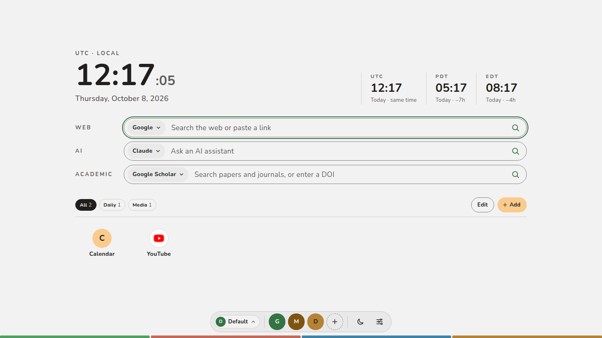

# Start Page — Chrome New Tab Extension

<p>
  
  
</p>

A Chrome extension (Manifest V3) that replaces the new tab page with a calm, local-first start page: clocks, three smart search boxes, shortcuts, and a launcher dock. Plain HTML, CSS and JavaScript modules — no framework, no build step.



*The new tab page with default settings. A fresh install starts with Calendar and YouTube shortcuts and a Google launcher.*

## Features

- **Clocks** — local time (12- or 24-hour; seconds shown smaller, on by default) and date plus configurable world clocks (UTC, PDT and EDT by default) with day and offset (“Tomorrow · +1h”). A clock shows its zone abbreviation, which follows daylight saving (PDT ↔ PST), unless you give it a label. Add one by abbreviation (PDT, CST, CET, JST…), city or zone name.
- **Three search boxes** — Web, AI and Academic, each with its own engine list and default (an engine list can be shown on all profiles). Picking another engine from the box menu lasts for that tab only; a new tab starts on the default. Any box opens `http(s)` links directly and sends DOIs (`10.x/…`, `doi:…`, `doi.org/…`) to doi.org; other schemes such as `javascript:` are blocked.
- **Suggestions** — recent queries from local history, plus web suggestions (Datamuse) in the Web box. ↑ ↓ to move, Enter to choose, Esc to close.
- **Shortcuts** — optional categories with filter chips (the category row, with its Edit and Add buttons, can be turned off in Settings → Layout; the shortcuts then move up into its place), paging (rows × per row), drag any tile to reorder, a quick-edit popover on each tile (with delete and New category…), a full editor (name, address, category, icon, and whether it shows on all profiles; the name is filled in from the website when you enter the address), an Add group button in Edit mode, an Edit mode with remove buttons and arrow-key reordering, and a Shortcuts tab in Settings that lists every shortcut to reorder, edit (in the same editor) or remove.
- **Launcher dock** — groups of links, shown with website icons, that preview on hover or focus and pin open on click. A launcher can show on all profiles. If a picture icon fails to load, a letter shows instead.
- **Profiles** — separate sets of settings (appearance, search engines, clocks, shortcuts, launchers, layout), for example Work and Home. Switch or add one from the profile button at the left of the dock; Settings → Profiles renames, changes each profile's icon, deletes, adds a blank profile or duplicates the one in use. Export covers the profile in use or all profiles, and import can keep a file's profiles as new, separate profiles; search history is shared.
- **Show on all profiles** — a shortcut or launcher can be marked "Show on all profiles" in its editor (a search box's engines have the same switch in Settings → Search). It then appears on every profile, edits to it apply everywhere, and deleting it removes it everywhere. Saving a change to it or deleting it asks for confirmation first; each profile keeps its own order. Turning it off keeps the item in the profile you are in only.
- **Icons** — every icon (shortcut, launcher, profile) is changed by clicking the icon itself, in Settings or in the shortcut editor. One picker offers a site's logo, an image from a web address, an uploaded image (scaled down to 128 px and stored in this browser), an emoji, or a solid color with a letter or without one. Pictures have an optional background (Auto adds a contrasting disc only for an all-white or all-black picture). Profiles can also have no icon.
- **Appearance** — light, dark or system theme; green, brown or ink accent; solid, gradient or image background, with separate background colors for the light and dark themes (dark defaults to #333333).
- **Colors** — every color picker (accent, background, icons) shows two base colors and a + button; the + opens the other preset colors and a field for any #HEX color.
- **Data** — export the current profile or all profiles to JSON, YAML, TOML or text, named `<date>-<profile or all>.<ext>`; imports are reviewed (fixed, skipped; choose which profiles; merge, replace or separate as new profiles) before anything changes. A backup restores every setting, icons included; merging takes the file's version of any shortcut or launcher you already have and keeps the rest.
- Keyboard: `/` focuses web search; `Esc` closes menus and dialogs; Ctrl/⌘ + Enter or click opens in a new tab.

## Install (unpacked)

1. Open `chrome://extensions` and turn on **Developer mode**.
2. Click **Load unpacked** and select this folder (the one containing `manifest.json`).
3. Open a new tab. Chrome may ask once whether to keep the page changed by the extension — choose **Keep it**.

To update after pulling changes, click the reload icon on the extension card. Chrome 104 or later is required.

To build a zip for the Chrome Web Store or sharing:

```sh
npm run pack   # writes dist/start-page.zip
```

## Privacy and network access

Settings and search history are stored in `chrome.storage.local` on this device and leave it only when you export them. Permissions:

- `storage` — save settings and history.
- `host_permissions` (all `http(s)` sites) — only so the shortcut editor can read the title of the address you type, to prefill the name. It makes one request to that address, without cookies or referrer, and reads nothing else; if it fails, a name is guessed from the address.
- `favicon` — show website icons from Chrome’s local favicon cache (no request to Google). When Chrome has no icon for a site yet, the page tries that site’s own `/favicon.ico` and `/apple-touch-icon.png`, then shows a letter.

Fonts (Nunito, Noto Sans TC) are bundled in `fonts/`, so the page loads them from disk. Network requests happen only for Datamuse suggestions in the Web box, the page you enter in the shortcut editor (for its name), icon files from your shortcut and launcher sites (as above), image links you set as icons (loaded without a referrer), and the destinations you open.

## Development

No dependencies. Node.js is needed only for the checks:

```sh
npm run verify   # syntax check + unit tests
```

The tests cover URL/DOI routing, engine templates, history, clocks, settings normalization and import reporting, profile list repair, merge, and every export format.

For quick UI work outside the extension, serve the folder (`python3 -m http.server`) and open `newtab.html`; settings then fall back to `localStorage` and website icons fall back to letters.

## Project structure

| Path | Purpose |
| --- | --- |
| `manifest.json` | Extension manifest: new tab override, permissions (including page reading for the name prefill), icons. |
| `newtab.html` | Page shell: stage, main column, dock. |
| `styles/newtab.css` | Design tokens (light/dark, accents) and all component styles. |
| `src/main.js` | Entry: loads settings, renders blocks, stage scaling, page-wide keys, cross-tab sync. |
| `src/core.js` | Pure logic: routing, validation, normalization, merge, import/export. |
| `src/storage.js` | `chrome.storage.local` (or `localStorage`) persistence and favicon URLs. |
| `src/state.js` | In-memory profiles/settings/history store with save-and-notify updates and profile actions. |
| `src/search.js`, `src/shortcuts.js`, `src/dock.js` | Main page blocks. |
| `src/shortcut-editor.js`, `src/settings.js`, `src/import-review.js`, `src/icon-picker.js` | Dialogs, including the shared icon picker. |
| `src/dom.js`, `src/widgets.js`, `src/appearance.js` | DOM helpers, shared widgets, theme application. |
| `icons/` | Extension icons. |
| `tests/core.test.js` | Node tests for `src/core.js`. |

## License

MIT — see [LICENSE](LICENSE).
